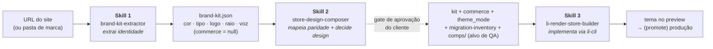
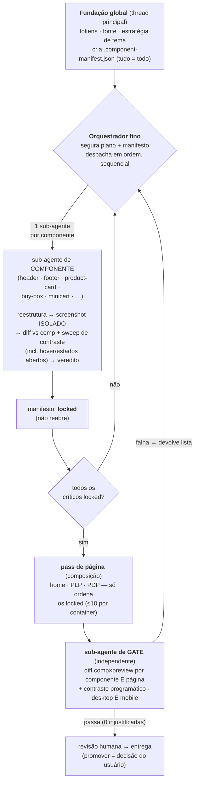

# li-render-skill

Kit de **migração/implementação de loja na Loja Integrada** usando o renderizador
**LI Render** (theme-as-code: JSON de páginas + Liquid + funções de dados, gerenciado
pela CLI `li-cli`), pensado para ser distribuído a **agências parceiras**.

São **três skills que se encontram em contratos compartilhados**, chamadas **em ordem**:
**1** extrai a marca → **2** desenha a loja (com gate de aprovação do cliente) →
**3** implementa o tema.

## Instalação (plugin do Claude Code)

Este repositório é um **marketplace de plugin** do Claude Code. Para instalar as 3
skills de uma vez, dentro do Claude Code:

```
/plugin marketplace add lucasbacic-li/li-render-skill
/plugin install li-render@li-render-skills
```

Atualizar quando sair versão nova:
```
/plugin marketplace update li-render-skills
```

As skills passam a ser descobertas automaticamente (disparam pela descrição) e podem
ser chamadas explicitamente por `/li-render:brand-kit-extractor`,
`/li-render:store-design-composer`, `/li-render:li-render-store-builder`.

> **Pré-requisito da Skill 3** (implementação): a CLI `li-cli` instalada e logada na
> conta do lojista — ver `skills/li-render-store-builder/references/li-render.md`.

## Fluxo das três skills



- **`brand-kit-extractor` (Skill 1)** — pega uma **URL** (Figma depois) e destila a
  identidade (cor, tipo, logo, raio, voz) num **brand-kit** leve. `commerce` sai
  `null` de propósito. Não toca na conta da Loja Integrada.
- **`store-design-composer` (Skill 2)** — o passo do **meio**, com **dois papéis**:
  (1) **mapeia a paridade** de migração com o site-fonte (home, menu, rodapé, busca/
  PLP/PDP, apps — eixos funcional + conteúdo) num **`migration-inventory.json`**,
  classificando o esforço contra o litheme; (2) **decide o design** — commerce, modo
  de tema (light/dark **único**) — e produz **comps HTML fiéis**, modernizando sem
  perder paridade. **Gate de aprovação do cliente** (comps + relatório de paridade).
- **`li-render-store-builder` (Skill 3)** — pega o **kit já desenhado** e implementa o
  tema na conta do lojista via `li-cli`: reskina o litheme, **verifica o preview ao
  vivo contra os comps** + as redes de QA, e (com aprovação) publica.

## Como a Skill 3 implementa (orquestração por sub-agentes)

A implementação **não** roda numa thread única (o contexto degrada e a disciplina de
convergência é pulada). É **orquestrada**: a thread principal fica fina (segura plano +
manifesto) e despacha **um sub-agente de contexto fresco por componente**; um
**sub-agente de gate independente** verifica cada página antes da revisão humana.



> O `.component-manifest.json` é a **memória entre execuções**: `locked` não reabre, e
> um tema retomado começa do 1º componente não-`locked`. Detalhe em
> `skills/li-render-store-builder/references/implementation-plan.md` §4.

## Estrutura

```
.claude-plugin/                    ← MANIFESTOS do plugin/marketplace
├── plugin.json                    ← o plugin "li-render" (aponta skills: ./skills/)
└── marketplace.json               ← marketplace "li-render-skills" (source ./)

skills/                            ← as skills + contratos (descobertas pelo Claude Code)
├── shared/                        ← CONTRATOS COMPARTILHADOS (irmão das skills)
│   ├── brand-kit-spec/            ← contrato de DADO (1 → 2 → 3): identidade + commerce + theme_mode
│   │   ├── brand-kit.spec.md      ← formato do brand-kit (fonte da verdade)
│   │   └── examples/brand.kit.example.json
│   ├── litheme-capabilities/      ← contrato de RESTRIÇÃO (2 desenha dentro, 3 implementa contra)
│   │   └── litheme-capabilities.spec.md
│   └── migration-inventory-spec/  ← contrato de PARIDADE (2 produz, 3 consome)
│       ├── migration-inventory.spec.md
│       └── examples/migration-inventory.example.json
│
├── brand-kit-extractor/           ← SKILL 1 (extrai) — URL → brand-kit
│   ├── SKILL.md                   ← 5 fases (capturar → destilar → montar → confirmar → entregar)
│   └── references/                ← url-ingestion, color-distillation, kit-output, platforms/
│
├── store-design-composer/         ← SKILL 2 (mapeia paridade + desenha) — brand-kit → inventory + commerce + comps
│   ├── SKILL.md                   ← 5 fases (derivar → INVENTARIAR → elicitar → comps → aprovação)
│   └── references/                ← content-surfaces (paridade), commerce-surfaces, comp-authoring, design-quality
│
└── li-render-store-builder/       ← SKILL 3 (implementa) — kit + comps → tema LI
    ├── SKILL.md                   ← 6 fases + redes de QA
    ├── references/                ← li-render, recipes, global-styling, litheme, QA…
    ├── scripts/                   ← audit de forks de estilo + diff de screenshots
    └── assets/                    ← exemplos de manifesto (input + componentes)
```
> As skills referenciam os contratos por `../shared/…` (a pasta `shared/` é irmã das
> skills dentro de `skills/`). Ao mover/empacotar, mantenha esse layout.

## Os contratos compartilhados

- **`brand-kit`** (dado) — fronteira 1→2→3. A Skill 1 escreve, a 2 enriquece
  (`commerce` + `theme_mode` + `comps/`), a 3 consome. `$schema: "li-render/brand-kit@1"`. Ver
  [skills/shared/brand-kit-spec/brand-kit.spec.md](skills/shared/brand-kit-spec/brand-kit.spec.md).
- **`litheme-capabilities`** (restrição) — o que o litheme renderiza barato + o mapa
  `theme_mode`→DaisyUI. A Skill 2 usa como guardrails; a 3 como alvo. Ver
  [skills/shared/litheme-capabilities/litheme-capabilities.spec.md](skills/shared/litheme-capabilities/litheme-capabilities.spec.md).
- **`migration-inventory`** (paridade) — o que precisa migrar do site-fonte (funcional
  + conteúdo), por superfície, no balde de esforço certo. A Skill 2 produz, a 3 consome
  e reporta paridade. `$schema: "li-render/migration-inventory@1"`. Ver
  [skills/shared/migration-inventory-spec/migration-inventory.spec.md](skills/shared/migration-inventory-spec/migration-inventory.spec.md).

## Glossário rápido

- **litheme** — o tema padrão da Loja Integrada que o `li-cli theme create` duplica;
  Tailwind v4 + DaisyUI v5. A Skill 3 **reskina** o litheme (não constrói do zero).
- **papéis (do kit)** — nomes semânticos de cor/tipo (`surface`, `ink`, `accent`…) que o
  brand-kit usa em vez de hex soltos; a Skill 3 os liga aos tokens DaisyUI.
- **comp** — maquete HTML fiel do alvo (por componente + por página); é a intenção de
  design que o cliente aprova **e** o alvo de QA que a Skill 3 persegue no preview.
- **chrome** — header/topbar/nav/footer (a "moldura" da loja), por oposição ao conteúdo.
- **manifesto** — `.component-manifest.json`: a fonte da verdade do que está `locked`.
- **gate** — verificação independente (sub-agente que não implementou) que diffa
  comp×preview e devolve uma lista; só passa com 0 divergências injustificadas.

## Estado

> Snapshot do que já funciona vs. o que falta. Para o histórico de como chegamos aqui
> (o que mudou de uma versão pra outra), ver [CHANGELOG.md](CHANGELOG.md).

- [x] **Contratos v1**: `brand-kit` (dado) + `litheme-capabilities` (restrição)
- [x] **Skill 3** validada ponta-a-ponta e **re-ancorada no litheme real** (v49)
- [x] **Faseamento ORQUESTRADO** na Skill 3 (orquestrador fino + 1 sub-agente por
      componente + manifesto-arquivo + sub-agente de gate independente) — antídoto para a
      degradação de contexto em thread única longa
- [x] **E2E real completo (caso anonimizado) rodado do zero a partir da Skill 3** —
      dark-chrome híbrido fiel (home/PLP/PDP/minicart, desktop+mobile); o **gate
      independente reprovou a PDP** que o agente de página racionalizara, e um fix focado
      reconvergeu (protocolo de orquestração **validado**)
- [x] **Round de feedback ao vivo** → 3 aprendizados genéricos gravados: o gate exerce
      **estados hover/aberto** (não só drawer); **bordas** como eixo do pass sistemático;
      **fidelidade do rodapé** (capturar Newsletter/"Pague com"/Selos/atribuição LI integrada)
- [x] **Baseline RENDERADO na Skill 1** (`scripts/capture-source.mjs`, Chrome headless) —
      `rendered.html` (DOM pós-JS) + `bands.json` (torre de faixas com modo/texto/imgs) +
      `full.png`, gravados em `reference/`. Fecha a brecha-raiz: o inventário/loop de comp diffa
      contra o **render ground-truth** (não `curl`/HTML cru nem descrição textual auto-autorada),
      **falha-fechado** sem baseline. `curl` fica só p/ cor+assets. Validado em caso real (pegou
      tarja+USP+7 vitrines+bloco editorial que o HTML cru escondia).
- [x] **`theme_mode` (modo único light/dark)**: a Skill 2 passa a decidir um modo único como
      default — misturas inconsistentes do site-fonte viram **débito de usabilidade**, não
      paridade a preservar. O **dark-chrome híbrido** (chrome escuro + conteúdo claro) deixa de
      ser o método padrão e vira **exceção cara e isolada**
      ([dark-hybrid-exception.md](skills/li-render-store-builder/references/dark-hybrid-exception.md)),
      só lida quando o kit pede híbrido explicitamente.
- [x] **Skill 2 reframada em 2 papéis + inventário de paridade**: (a) **auditar** paridade
      funcional + de conteúdo do site-fonte contra um catálogo canônico BR
      ([content-surfaces.md](skills/store-design-composer/references/content-surfaces.md)) e
      produzir `migration-inventory.json` (contrato novo,
      [skills/shared/migration-inventory-spec/](skills/shared/migration-inventory-spec/)); (b)
      aplicar os tokens do kit e **modernizar sem perder paridade**. A Skill 2 passa a ter 5
      fases (nova Fase 2 = Inventariar); o gate do inventário **só alerta, nunca bloqueia** — a
      decisão final é sempre do humano (Fase 5).
- [x] **Craft "herdar × ganhar"**
      ([design-quality.md](skills/store-design-composer/references/design-quality.md)): régua
      que separa o que a migração deve **herdar** do kit (paleta/fonte/voz/logo/raio, sem
      reinventar) do que deve **ganhar** em craft mecânico (layout, espaçamento, contraste,
      estados, responsivo, motion) — sem virar licença para inventar conteúdo que o site-fonte
      não tem.
- [x] **Campo `layout`** no brand-kit (`contained`/`fluid-up`, `max_width`, `gutter`,
      `full_bleed`) — decisão de largura consumida pelas 3 skills.
- [x] **Enforcement hardening do gate da Skill 3**: "pronto" virou **artefato**, não veredito —
      `locked` exige evidência de diff **e** um verificador diferente de quem implementou; o
      orquestrador não edita mais nenhum arquivo (fundação inclusa, sempre por sub-agente); a
      Skill 3 sempre começa em sessão fresca (lê arquivos, não memória de conversa das Skills 1/2).
- [x] **Empacotado como plugin do Claude Code** (marketplace no repo, skills sob `skills/`)
- [ ] Implementar a porta **Figma** da Skill 1 (mesmo contrato, captura diferente) e a geração
      automática de comps da Skill 2

## Referências
- Doc oficial do LI Render: `https://{slug}-preview.lojas.li/.docs/` — a mesma doc é
  servida no preview de **qualquer** conta; troque `{slug}` pelo slug da loja.
- Notas técnicas: [skills/li-render-store-builder/references/li-render.md](skills/li-render-store-builder/references/li-render.md)
```
