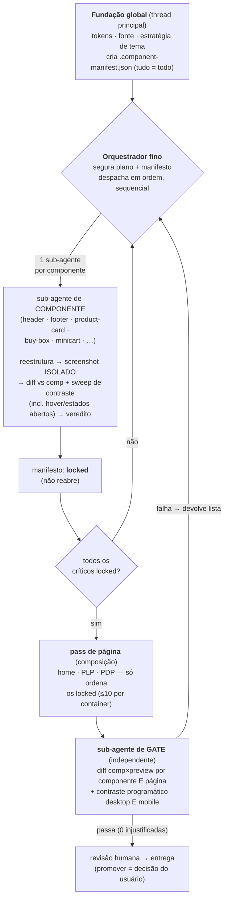

# li-render-skill

Kit de **migração/implementação de loja na Loja Integrada** usando o renderizador
**LI Render** (theme-as-code: JSON de páginas + Liquid + funções de dados, gerenciado
pela CLI `li-cli`), pensado para ser distribuído a **agências parceiras**.

São **três skills que se encontram em contratos compartilhados**, chamadas **em ordem**:
**1** extrai a marca → **2** desenha a loja (com gate de aprovação do cliente) →
**3** implementa o tema.

## Fluxo das três skills

```mermaid
flowchart LR
    URL["URL do site<br/>(ou pasta de marca)"] --> S1
    S1["<b>Skill 1</b><br/>brand-kit-extractor<br/><i>extrai identidade</i>"] --> BK["brand-kit.json<br/>cor · tipo · logo · raio · voz<br/>(commerce = null)"]
    BK --> S2["<b>Skill 2</b><br/>store-design-composer<br/><i>decide commerce + comps</i>"]
    S2 -. "gate de aprovação<br/>do cliente" .-> KIT["kit + bloco commerce<br/>+ comps/ (alvo de QA)"]
    KIT --> S3["<b>Skill 3</b><br/>li-render-store-builder<br/><i>implementa via li-cli</i>"]
    S3 --> THEME["tema no preview<br/>→ (promote) produção"]
```



- **`brand-kit-extractor` (Skill 1)** — pega uma **URL** (Figma depois) e destila a
  identidade (cor, tipo, logo, raio, voz) num **brand-kit** leve. `commerce` sai
  `null` de propósito. Não toca na conta da Loja Integrada.
- **`store-design-composer` (Skill 2)** — o passo do **meio**: decide as superfícies de
  commerce (**mini-cart, busca/PLP, PDP** — que o scrape não responde), grava no
  bloco `commerce` do kit e produz **comps HTML fiéis** do alvo. **Gate de
  aprovação do cliente** antes da implementação.
- **`li-render-store-builder` (Skill 3)** — pega o **kit já desenhado** e implementa o
  tema na conta do lojista via `li-cli`: reskina o litheme, **verifica o preview ao
  vivo contra os comps** + as redes de QA, e (com aprovação) publica.

## Como a Skill 3 implementa (orquestração por sub-agentes)

A implementação **não** roda numa thread única (o contexto degrada e a disciplina de
convergência é pulada). É **orquestrada**: a thread principal fica fina (segura plano +
manifesto) e despacha **um sub-agente de contexto fresco por componente**; um
**sub-agente de gate independente** verifica cada página antes da revisão humana.



> O `.component-manifest.json` é a **memória entre execuções**: `locked` não reabre, e
> um tema retomado começa do 1º componente não-`locked`. Detalhe em
> `li-render-store-builder/references/implementation-plan.md` §4.

## Estrutura

```
shared/                            ← CONTRATOS COMPARTILHADOS (sempre copie junto)
├── brand-kit-spec/                ← contrato de DADO (1 → 2 → 3)
│   ├── brand-kit.spec.md          ← formato do brand-kit (fonte da verdade)
│   └── examples/brand.kit.example.json
└── litheme-capabilities/          ← contrato de RESTRIÇÃO (2 desenha dentro, 3 implementa contra)
    └── litheme-capabilities.spec.md

brand-kit-extractor/               ← SKILL 1 (extrai) — URL → brand-kit
├── SKILL.md                       ← 5 fases (capturar → destilar → montar → confirmar → entregar)
└── references/                    ← url-ingestion, color-distillation, kit-output, platforms/

store-design-composer/             ← SKILL 2 (desenha) — brand-kit → commerce + comps
├── SKILL.md                       ← 4 fases (derivar → elicitar → comps → aprovação)
└── references/                    ← commerce-surfaces (matriz de decisão), comp-authoring

li-render-store-builder/           ← SKILL 3 (implementa) — kit + comps → tema LI
├── SKILL.md                       ← 6 fases + redes de QA
├── references/                    ← li-render, recipes, global-styling, litheme, QA…
├── scripts/                       ← audit de forks de estilo + diff de screenshots
└── assets/                        ← exemplos de manifesto (input + componentes)
```

## Os contratos compartilhados

- **`brand-kit`** (dado) — fronteira 1→2→3. A Skill 1 escreve, a 2 enriquece
  (`commerce` + `comps/`), a 3 consome. `$schema: "li-render/brand-kit@1"`. Ver
  [shared/brand-kit-spec/brand-kit.spec.md](shared/brand-kit-spec/brand-kit.spec.md).
- **`litheme-capabilities`** (restrição) — o que o litheme renderiza barato. A Skill 2
  usa como guardrails de design; a 3 como alvo de implementação. Ver
  [shared/litheme-capabilities/litheme-capabilities.spec.md](shared/litheme-capabilities/litheme-capabilities.spec.md).

> **Empacotamento:** os references usam caminhos relativos `../shared/…`. Ao distribuir
> uma skill isolada, **leve a pasta `shared/` junto** (senão os links quebram).

## Glossário rápido

- **litheme** — o tema padrão da Loja Integrada que o `li-cli theme create` duplica;
  Tailwind v4 + DaisyUI v5. A Skill 3 **reskina** o litheme (não constrói do zero).
- **papéis (do kit)** — nomes semânticos de cor/tipo (`surface`, `ink`, `accent`…) que o
  brand-kit usa em vez de hex soltos; a Skill 3 os liga aos tokens DaisyUI.
- **comp** — maquete HTML fiel do alvo (por componente + por página); é a intenção de
  design que o cliente aprova **e** o alvo de QA que a Skill 3 persegue no preview.
- **chrome** — header/topbar/nav/footer (a "moldura" da loja), por oposição ao conteúdo.
- **manifesto** — `.component-manifest.json`: a fonte da verdade do que está `locked`.
- **gate** — verificação independente (sub-agente que não implementou) que diffa
  comp×preview e devolve uma lista; só passa com 0 divergências injustificadas.

## Estado

- [x] **Contratos v1**: `brand-kit` (dado) + `litheme-capabilities` (restrição)
- [x] **Skill 3** validada ponta-a-ponta e **re-ancorada no litheme real** (v49)
- [x] **Faseamento ORQUESTRADO** na Skill 3 (orquestrador fino + 1 sub-agente por
      componente + manifesto-arquivo + sub-agente de gate independente) — antídoto para a
      degradação de contexto em thread única longa
- [x] **E2E real completo (caso anonimizado) rodado do zero a partir da Skill 3** —
      dark-chrome híbrido fiel (home/PLP/PDP/minicart, desktop+mobile); o **gate
      independente reprovou a PDP** que o agente de página racionalizara, e um fix focado
      reconvergeu (protocolo de orquestração **validado**)
- [x] **Round de feedback ao vivo** → 3 aprendizados genéricos gravados: o gate exerce
      **estados hover/aberto** (não só drawer); **bordas** como eixo do pass sistemático;
      **fidelidade do rodapé** (capturar Newsletter/"Pague com"/Selos/atribuição LI integrada)
- [ ] Implementar a captura real da Skill 1 (URL/Figma) e a geração de comps da Skill 2
- [ ] Empacotar como plugin Claude Code para as agências

## Referências
- Doc oficial do LI Render: `https://{slug}-preview.lojas.li/.docs/` — a mesma doc é
  servida no preview de **qualquer** conta; troque `{slug}` pelo slug da loja.
- Notas técnicas: [li-render-store-builder/references/li-render.md](li-render-store-builder/references/li-render.md)
```
